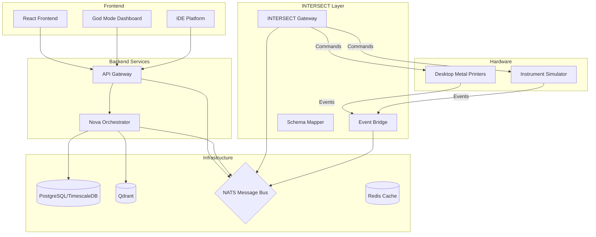

# Architecture Overview

The ADAM platform is built as a modular microservices architecture, separating the user interface, orchestration logic, and hardware control layers.

## System Diagram

## Component Layers

### 1. Frontend Layer
Built with React 19, TypeScript, and Vite.
- **Marketing Page**: Landing/Reception area.
- **God Mode Dashboard**: A "StarCraft 2" style command center for global fleet management.
- **IDE Platform**: The workspace for designing experiments and interacting with agents.

### 2. Backend Services Layer
- **API Gateway**: The entry point for the frontend, handling REST API requests and WebSocket connections for real-time updates.
- **Nova Orchestrator**: The "brain" of the system. It manages experiment planning, executes agent workflows, and coordinates with the hardware layer.

### 3. INTERSECT Integration Layer
This layer acts as the bridge between ADAM's high-level commands and the low-level hardware protocols. It implements the [ORNL INTERSECT](https://intersect-architecture.readthedocs.io/) pattern.
- **Gateway Service**: Routes commands (Actions/Activities) to specific instruments.
- **Event Bridge**: Ingests asynchronous events from instruments and normalizes them.
- **Schema Mapper**: Translates ADAM's internal experiment models into INTERSECT-compliant JSON schemas.

### 4. Infrastructure Layer
- **PostgreSQL / TimescaleDB**: Stores structured data (users, experiments) and time-series data (sensor readings).
- **Qdrant**: Vector database used by the AI agents for semantic search and memory.
- **NATS**: The central nervous system. A high-performance message broker that enables event-driven communication between services.
- **Redis**: Caching and temporary state storage.

## Data Flow
1. **User Action**: A user submits an experiment plan via the IDE.
2. **Orchestration**: Nova receives the plan, decomposes it into tasks, and schedules them.
3. **Execution**: Nova publishes a command to NATS.
4. **Translation**: The INTERSECT integration layer picks up the command, validates it against the capability contract, and forwards it to the target instrument.
5. **Feedback**: The instrument executes the command and streams status events back via NATS, which Nova consumers to update the experiment state.
